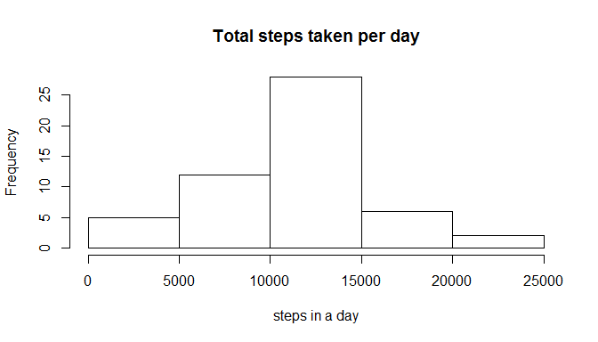
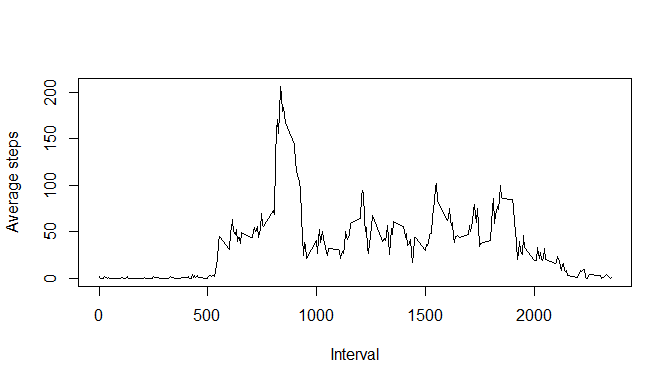
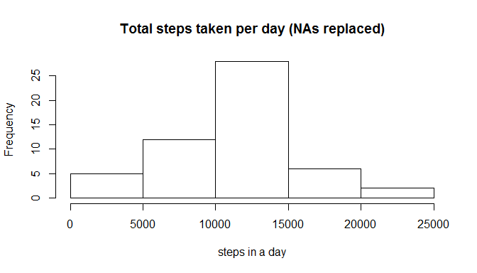
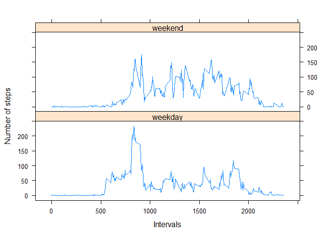

# Reproducible Research: Peer Assessment 1


## Loading and preprocessing the data


```r
library("data.table")
library("dplyr")
library("lattice")
Sys.setlocale("LC_TIME","English")
```

```
## [1] "English_United States.1252"
```

```r
data <- fread("activity.csv")
original_data <- tbl_df(data)
rm("data")
by_date <- group_by(original_data, date)
sum_data <- summarize(by_date, sum(steps))
by_interval <- group_by(original_data, interval)
mean_interval <- summarize(by_interval, mean = mean(steps, na.rm = TRUE))
```

## What is mean total number of steps taken per day?


```r
hist(sum_data$sum, main= "Total steps taken per day", xlab= "steps in a day")
```

 

### The mean total number of steps by day is:

```r
mean(sum_data$sum, na.rm = TRUE)
```

```
## [1] 10766.19
```

### The median total number of steps by day is:

```r
median(sum_data$sum, na.rm = TRUE)
```

```
## [1] 10765
```

## What is the average daily activity pattern?

```r
plot( mean_interval$interval, mean_interval$mean, type= "l", xlab = "Interval", ylab= "Average steps")
```

 

### The 5-minute interval with the maximun average is:

```r
head(arrange(mean_interval, desc(mean)),1)
```

```
## Source: local data frame [1 x 2]
## 
##   interval     mean
## 1      835 206.1698
```

## Imputing missing values

### Ammount of NAs in the data

```r
sum(is.na(original_data))
```

```
## [1] 2304
```
#### The NAs will be replaced by the mean steps taken in every 5-minute period


```r
replaced <- original_data
replaced[is.na(replaced)] <- mean(original_data$steps, na.rm = TRUE)
replaced_by_date <- group_by(replaced, date)
replaced_sum_data <- summarize(by_date, sum(steps))

hist(replaced_sum_data$sum,main= "Total steps taken per day (NAs replaced)", xlab= "steps in a day" )
```

 

### The mean total number of steps by day is: (NAs replaced)

```r
mean(replaced_sum_data$sum, na.rm = TRUE)
```

```
## [1] 10766.19
```

### The median total number of steps by day is: (NAs replaced)

```r
median(replaced_sum_data$sum, na.rm = TRUE)
```

```
## [1] 10765
```
#### Both the mean and the median are unnafected by the replace of the NAs


## Are there differences in activity patterns between weekdays and weekends?

```r
original_data$date <- as.Date(original_data$date)
original_data$weekend <- FALSE
original_data$weekend <- weekdays(original_data$date) == "Sunday" | weekdays(original_data$date) == "Saturday"
weekend_data <- subset(original_data, weekend == TRUE)
weekday_data <- subset(original_data, weekend == FALSE)
weekend_by_interval <- group_by(weekend_data, interval)
weekday_by_interval <- group_by(weekday_data, interval)
weekday_mean_interval <- summarize(weekday_by_interval, mean(steps, na.rm = TRUE))
weekend_mean_interval <- summarize(weekend_by_interval, mean(steps, na.rm = TRUE))
weekend_mean_interval$daytype <- "weekend"
weekday_mean_interval$daytype <- "weekday"
factored_data <- rbind(weekday_mean_interval, weekend_mean_interval)
xyplot( factored_data$mean  ~ interval | daytype, data=factored_data, type="l", xlab= "Intervals", ylab= "Number of steps", layout=c(1,2))
```

 
